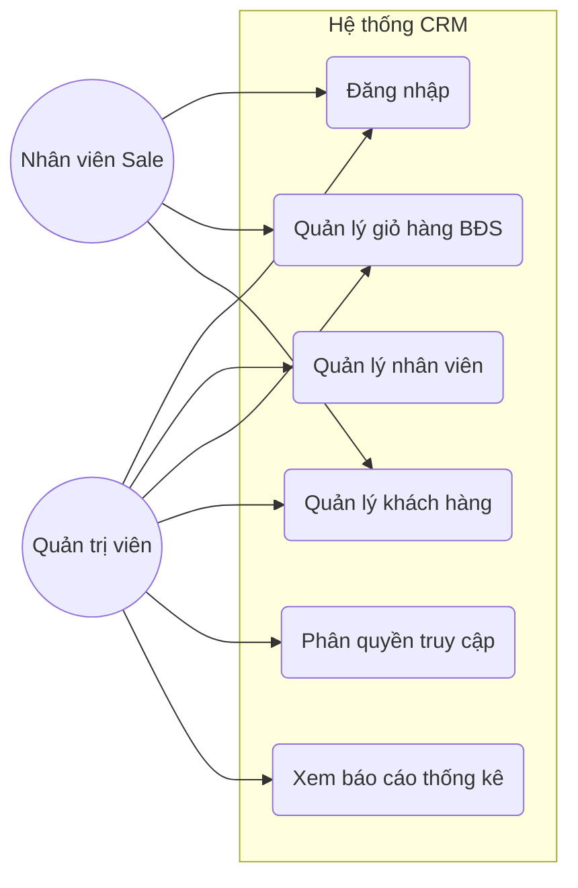
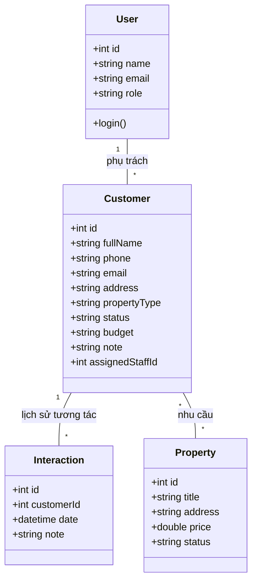
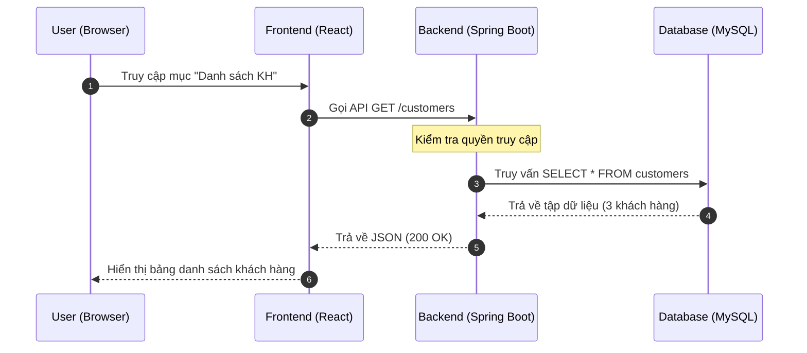
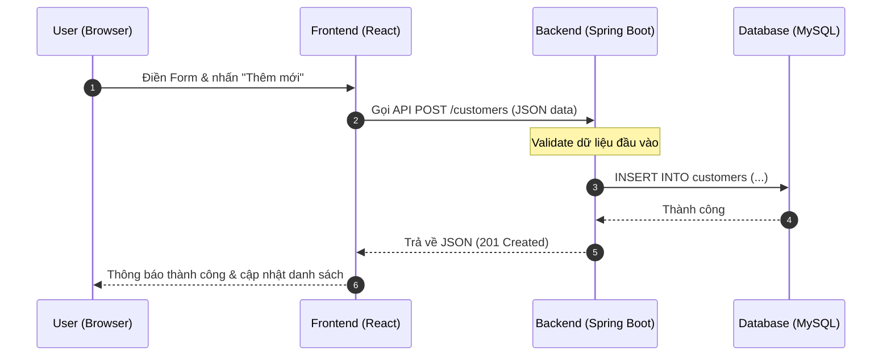
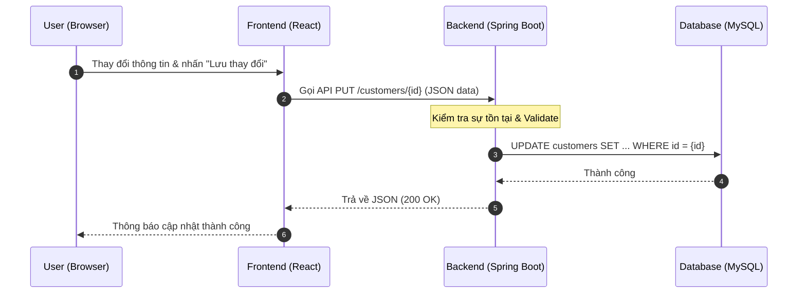
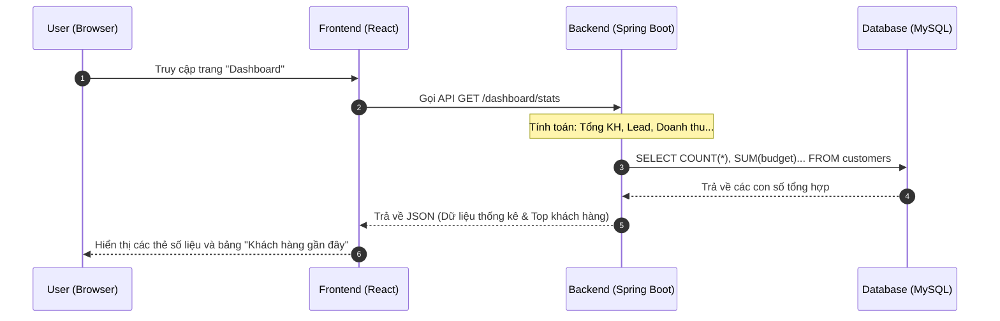

# 🏢 Real Estate CRM - Hệ Thống Quản Lý Bất Động Sản

## 🌟 Giới Thiệu Dự Án
Dự án **Real Estate CRM** được xây dựng nhằm giải quyết bài toán quản lý tập trung dữ liệu khách hàng và giỏ hàng cho các sàn giao dịch bất động sản. Hệ thống giúp tối ưu hóa quy trình vận hành, phân quyền nhân viên và theo dõi lịch sử tương tác khách hàng một cách khoa học.

---

## 👥 Đội Ngũ Phát Triển (Nhóm 17)
| STT | Họ và Tên | MSSV | Vai trò chính |
|:---:|---|---|---|
| 1 | Trương Lý Quốc Toàn | DH52201595 | Backend Lead |
| 2 | Trương Nguyễn Tường Vy | DH52201788 | Frontend Lead |
| 3 | Tạ Thanh Tấn | DH52201416 | Backend Developer |
| 4 | Trần Võ Thúy Vy | DH52201787 | Frontend Developer |
| 5 | Trương Đàm Công Quý | DH52201336 | QA & Deployment |
| 6 | **Huỳnh Lê Thu Hương** | **DH52200755** | **Thiết kế hệ thống & Tài liệu** |

---

## 🏗 Thiết Kế Hệ Thống (System Design)

### 1. Sơ đồ Use Case (Use Case Diagram)

### 2. Sơ đồ Lớp (Class Diagram - Database Schema)

### 3. Sơ đồ Tuần tự (Sequence Diagram)
#### A. Luồng lấy danh sách Khách hàng

#### B. Luồng thêm mới Khách hàng

#### C. Luồng chỉnh sửa Khách hàng

#### D. Luồng thống kê Dashboard

---

## 🛠 Công Nghệ Sử Dụng
- **Frontend:** ReactJS.
- **Backend:** Spring Boot.
- **Database:** MySQL.

---

## 📅 Lộ Trình Phát Triển (Roadmap)
- [x] Thiết lập cấu trúc dự án & UI cơ bản.
- [x] Xây dựng API CRUD User (Yêu cầu kiểm tra 14/3).
- [ ] Hoàn thiện module Quản lý Khách hàng.
- [ ] Triển khai module Giỏ hàng Bất động sản.

---
*Tài liệu được duy trì bởi **Huỳnh Lê Thu Hương**.*
