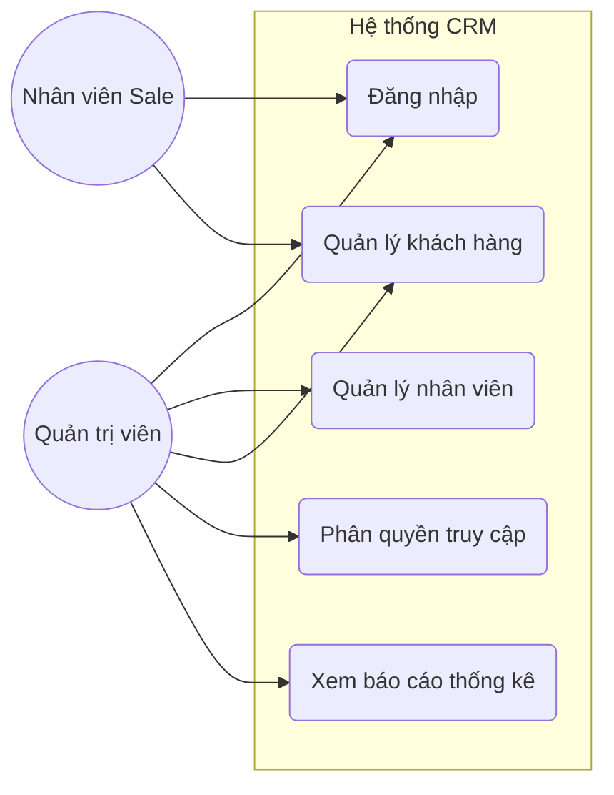
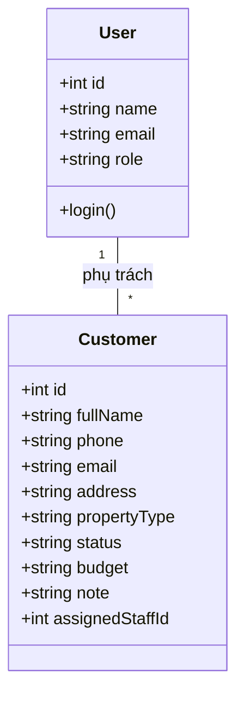
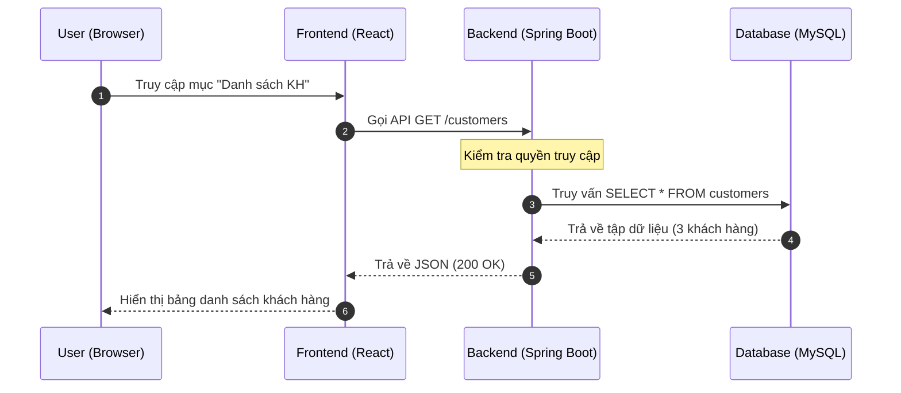
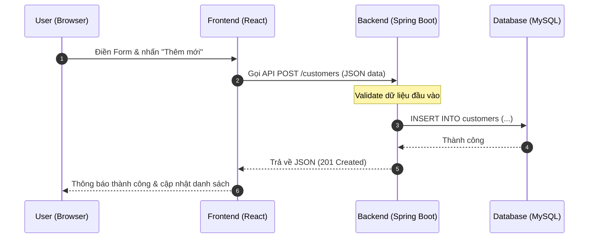
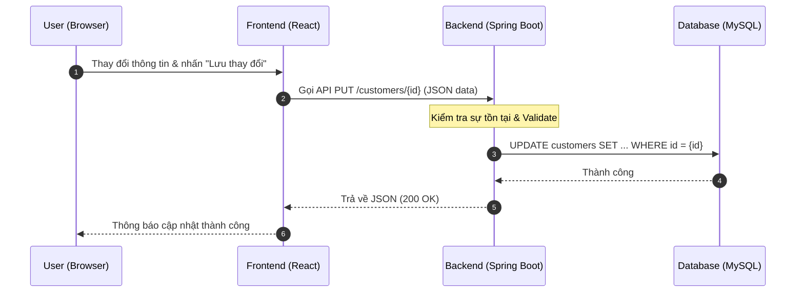
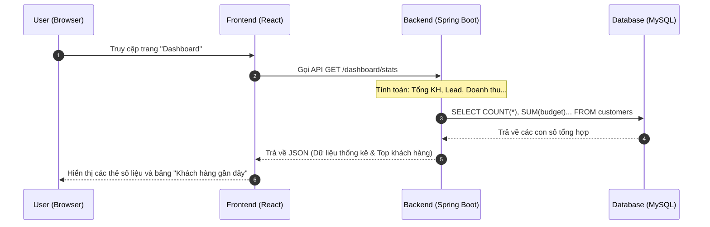
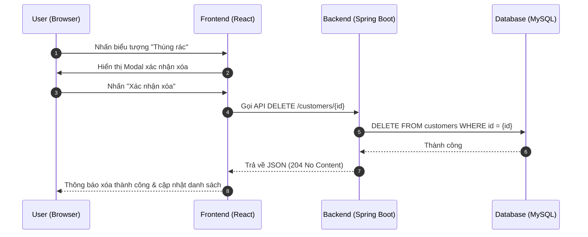

# 🏢 Real Estate CRM - Hệ Thống Quản Lý Khách Hàng Bất Động Sản

## 🌟 Giới Thiệu Dự Án
**Real Estate CRM** là một ứng dụng quản lý khách hàng chuyên biệt cho lĩnh vực bất động sản, được thiết kế với giao diện hiện đại, tối ưu trải nghiệm người dùng (UX/UI). Hệ thống cung cấp cái nhìn tổng quan và chi tiết về tệp khách hàng tiềm năng, giúp môi giới và sàn giao dịch theo dõi sát sao nhu cầu và tiến độ giao dịch.

### 🚀 Các Tính Năng Chính:
*   **Bảng Điều Khiển (Dashboard):** Theo dõi trực quan các chỉ số quan trọng như tổng số khách hàng, lượng Lead mới, số lượng giao dịch thành công và tổng ngân sách dự kiến thông qua các biểu đồ Recharts sinh động.
*   **Quản Lý Khách Hàng:** Danh sách khách hàng thông minh với khả năng tìm kiếm nhanh theo tên, số điện thoại hoặc email.
*   **Chi Tiết Khách Hàng:** Lưu trữ đầy đủ thông tin từ liên hệ, loại bất động sản quan tâm (Căn hộ, Đất nền, Nhà phố, Biệt thự), ngân sách đến trạng thái chăm sóc (Lead, Dự kiến, Liên hệ, Ký hợp đồng, Đã bán).
*   **Thao Tác CRUD Toàn Diện:** Thêm mới, chỉnh sửa thông tin và xóa khách hàng với quy trình xác nhận an toàn.
*   **Giao Diện Phản Hồi (Responsive):** Hoạt động mượt mà trên nhiều thiết bị, tích hợp hiệu ứng chuyển động chuyên nghiệp từ Framer Motion.

---

## 👥 Đội Ngũ Phát Triển (Nhóm 17)
| STT | Họ và Tên | MSSV | Vai trò chính |
|:---:|---|---|---|
| 1 | Trương Lý Quốc Toàn | DH52201595 | Backend Lead |
| 2 | Trương Nguyễn Tường Vy | DH52201788 | Frontend Lead |
| 3 | Tạ Thanh Tấn | DH52201416 | Backend Developer |
| 4 | Trần Võ Thúy Vy | DH52201787 | Frontend Developer |
| 5 | Trương Đàm Công Quý | DH52201336 | QA & Deployment |
| 6 | Huỳnh Lê Thu Hương | DH52200755 | Thiết kế hệ thống & Tài liệu |

---

## 🏗 Thiết Kế Hệ Thống (System Design)

### 1. Sơ đồ Use Case (Use Case Diagram)

### 2. Sơ đồ Lớp (Class Diagram - Database Schema)

### 3. Sơ đồ Tuần tự (Sequence Diagram)
#### A. Luồng lấy danh sách Khách hàng

#### B. Luồng thêm mới Khách hàng

#### C. Luồng chỉnh sửa Khách hàng

#### D. Luồng thống kê Dashboard

#### E. Luồng xóa Khách hàng

---

## 🛠 Công Nghệ Sử Dụng
- **Frontend:** ReactJS.
- **Backend:** Spring Boot.
- **Database:** MySQL.

---

## 📅 Lộ Trình Phát Triển (Roadmap)
- [x] Thiết lập cấu trúc dự án & UI Dashboard.
- [x] Xây dựng API CRUD User & Customer.
- [x] Hoàn thiện tính năng Thêm, Sửa, Xóa khách hàng.
- [ ] Tối ưu hóa báo cáo thống kê chuyên sâu.

---

